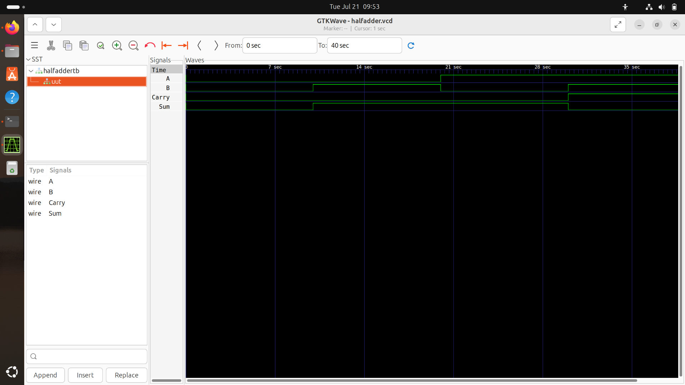

<div align="center">  

# Half Adder - Complete RTL-to-GDSII ASIC Flow 🚀  
### A Silicon Journey: From Behavioral Verilog to Sky130 Manufacturing-Ready Layout  

[](https://github.com/The-OpenROAD-Project/OpenLane)
[](https://github.com/google/skywater-pdk) 
[](#) 
[](#) 

*Documenting the complete physical design realization of a 1-bit Half Adder using the open-source OpenLane toolchain and SkyWater 130nm standard cell library.*  

  

---  

**[Explore the Visual Journey](#-the-rtl-to-gdsii-visual-journey) • [Reproduce the Flow](#-how-to-reproduce) • [Repository Structure](#-repository-structure)**  

</div>  

---  

## 💡 Project Overview & Physical Constraints  

A **Half Adder** serves as a fundamental combinational building block in digital arithmetic circuits. It adds two single-bit binary inputs (`A` and `B`) to produce a `Sum` (`A ^ B`) and a `Carry` (`A & B`). Although simple in logic, implementing it through an ASIC design flow provides a complete blueprint for standard cell mapping, gate-level synthesis, power grid distribution, floorplanning, placement, and physical layout generation.  

This project drives a behavioral Verilog implementation of a Half Adder completely through the automated **OpenLane** flow to achieve a tapeout-ready layout targeting the **SkyWater 130nm (sky130A)** open PDK.  

---  

## 🛠️ Tools & Technology Stack  

| Flow Stage | Open-Source Tool / PDK | Function |  
| :--- | :--- | :--- |  
| **Process Node** | SkyWater 130nm (`sky130A`) | Target silicon manufacturing technology |  
| **Functional Verification** | Icarus Verilog (`iverilog`) & GTKWave | RTL simulation and waveform debugging |  
| **Logic Synthesis** | Yosys & abc | Gate-level netlist generation & tech-mapping |  
| **Floorplan & Placement** | OpenROAD | Core/die initialization, PDN, and cell placement |  
| **Clock Tree & Routing** | OpenROAD (TritonRoute) | Global and detailed interconnect routing |  
| **Physical Verification** | Magic, KLayout & Netgen | Signoff DRC checks, layout viewing, and LVS netlist comparison |  

---  

## 📖 The RTL-to-GDSII Visual Journey  

Follow the automated physical design pipeline execution step-by-step with verified visual checkpoints from our runtime workspace:  

### 1️⃣ RTL Design & Functional Verification  

The behavioral logic of the Half Adder was validated using a comprehensive testbench (`src/halfaddertb.v`). Waveform inspection confirms correct output transitions across all standard binary input combinations (`00`, `01`, `10`, `11`) with zero delay overhead in behavioral simulation.  

<p align="center">  
    
</p>  

### 2️⃣ Logic Synthesis (Yosys)  

The Verilog source description (`src/halfadder.v`) is translated into structural gates and mapped to standard cells within the `sky130_fd_sc_hd` (high density) library.  

**Power Analysis (`2-syn_sta.power.rpt` @ Typical Corner):**
* **Internal Power:** `4.41e-07 W` (24.1%)  
* **Switching Power:** `1.39e-06 W` (75.9%)  
* **Leakage Power:** `1.01e-11 W` (0.0%)  
* **Total Power:** `1.83e-06 W` (1.83 μW)  

<p align="center">  
    
    
</p>  

### 3️⃣ Floorplanning & Power Delivery Network (PDN)  

The core boundary is initialized and I/O pins (`A`, `B`, `Sum`, `Carry`) are placed along the periphery. Power grid generation defines vertical and horizontal stripes (`VDD`/`GND`) for low-resistance power delivery across the core logic matrix.  

> 💡 **Pro-Tip for Interactive Workspace Viewing:**  
> To explore the layout database interactively using OpenROAD GUI:  
> 1. Start the container: `make mount`  
> 2. Open the interface: `openroad -gui`  
> 3. Source the layout database file: `read_db runs/<run_name>/results/floorplan/halfadder.odb`  

<p align="center">  
    
</p>  

### 4️⃣ Global & Detailed Placement  

Standard cells representing XOR and AND gate functions are legally assigned to standard rows. Wire length and pin congestion are minimized to optimize logic delay across output terminals.  

<p align="center">  
    
</p>  

### 5️⃣ Interconnect Routing  

Signal paths connecting `A`, `B`, `Sum`, and `Carry` are routed over multi-layer metal grids (`met1` to `met5`). Global routing plans signal paths, while detailed routing completes connection tracks while ensuring spacing and antenna rule constraints are met.  

<p align="center">  
    
</p>  

### 6️⃣ Physical Signoff & Manufacturing Verification (DRC/LVS)  

The resulting GDSII layout was exported and verified using KLayout and Magic for physical verification checks, passing zero Design Rule Check (DRC) violations and achieving complete LVS alignment.  

<p align="center">  
    
</p>  

---  

## 📂 Repository Structure  

```text  
├── halfadderss/          # Verified visual logs, waves, and layout screenshots  
│   ├── area (1).png  
│   ├── drc (1).png  
│   ├── floorplan (1).png  
│   ├── gtkwave.png  
│   ├── klayout (1).png  
│   ├── placement (1).png  
│   ├── power (1).png  
│   └── routing (1).png  
├── src/                  # Behavioral Verilog files (*.v) and simulation testbenches  
│   ├── halfadder.v       # Top module RTL implementation  
│   ├── halfaddertb.v     # Testbench module  
│   ├── halfadder.vcd     # Waveform dump file  
│   └── halfadder.vvp     # Compiled Icarus Verilog binary  
├── config.json           # OpenLane floorplan constraints and design configurations  
├── halfadder.gds         # Exported binary stream format for foundry fabrication
```
## 🚀 How to Reproduce

Rebuild this physical layout blueprint on your local environment:

### Prerequisites:
1. Linux OS (Ubuntu 20.04/22.04 recommended)
2. Docker engine installed and configured
3. OpenLane workspace clone with configured Sky130 PDK

---

### Step 1: Execute Functional Verification

Compile and simulate the behavioral netlist:

```
# Compile design and testbench modules
iverilog -o src/halfadder.vvp src/halfadder.v src/halfaddertb.v

# Execute simulation runtime to output VCD dump
vvp src/halfadder.vvp

# Open wave structures visually
gtkwave halfadder.vcd
```
### Step 2: Run the Physical Design Pipeline

Move this design directory inside your native OpenLane installation route under `<OpenLane_Root>/designs/`.

1. Mount the interactive OpenLane environment container:
```
make mount
```
1. Run the automated layout generation script:
```
./flow.tcl -design halfadder
```
## 🤝 Acknowledgments

1. **Google / SkyWater Foundation:** For open-sourcing the Sky130nm PDK.
2. **The OpenROAD Project:** For developing open-source automated EDA placement and routing tools.
3. **OpenLane:** For providing the automated end-to-end RTL-to-GDSII flow scriptable architecture.
